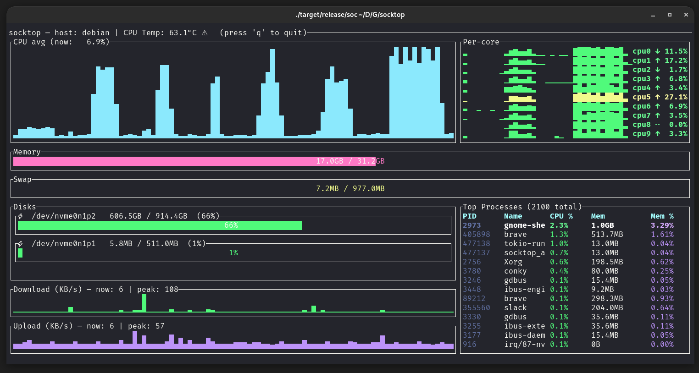

# socktop

**socktop** is a remote system monitor with a rich TUI interface, inspired by `top` and `btop`, that communicates with a lightweight remote agent over WebSockets.

It lets you watch CPU, memory, disks, network, temperatures, and processes on another machine in real-time — from the comfort of your terminal.



---

## Features

- 📡 **Remote monitoring** via WebSocket — lightweight agent sends JSON metrics
- 🖥 **Rich TUI** built with [ratatui](https://github.com/ratatui-org/ratatui)
- 🔍 **Detailed CPU view** — per-core history, current load, and trends
- 📊 **Memory, Swap, Disk usage** — human-readable units, color-coded
- 🌡 **Temperatures** — CPU temperature with visual indicators
- 📈 **Network throughput** — live sparkline graphs with peak tracking
- 🏷 **Top processes table** — PID, name, CPU%, memory, and memory%
- 🎨 Color-coded load, zebra striping for readability
- ⌨ **Keyboard shortcuts**:
  - `q` / `Esc` → Quit

---

## Architecture

`socktop` has **two components**:

1. **Agent** (remote side)  
   A small Rust WebSocket server that runs on the target machine and gathers metrics via [sysinfo](https://crates.io/crates/sysinfo).

2. **Client** (local side)  
   The TUI app (`socktop`) that connects to the agent’s `/ws` endpoint, receives JSON metrics, and renders them.

The two communicate over a persistent WebSocket connection.

---

## Installation

### Prerequisites
- Rust 1.75+ (recommended latest stable)
- Cargo package manager

### Build from source
```bash
git clone https://github.com/YOURNAME/socktop.git
cd socktop
cargo build --release
```

### Install as a cargo binary
```bash
cargo install --path .
```
This will install the `socktop` binary into `~/.cargo/bin`.

---

## Running

### 1. Start the agent on the remote machine
The agent binary listens on a TCP port and serves `/ws`:

```bash
remote_agent 0.0.0.0:8080
```

> **Tip:** You can run the agent under `systemd`, inside a Docker container, or just in a tmux/screen session.

### 2. Connect with the client
From your local machine:
```bash
socktop ws://REMOTE_HOST:8080/ws
```

Example:
```bash
socktop ws://192.168.1.50:8080/ws
```

---

## Usage

When connected, `socktop` displays:

**Left column:**
- **CPU avg graph** — sparkline of recent overall CPU usage
- **Memory gauge** — total and used RAM
- **Swap gauge** — total and used swap
- **Disks** — usage per device (only devices with available space > 0)
- **Network Download/Upload** — sparkline in KB/s, with current & peak values

**Right column:**
- **Per-core history & trends** — each core’s recent load, current %, and trend arrow
- **Top processes table** — top 20 processes with PID, name, CPU%, memory usage, and memory%

---

## Keyboard Shortcuts

| Key         | Action     |
|-------------|------------|
| `q` or `Esc`| Quit       |

---

## Example agent JSON
`socktop` expects the agent to send metrics in this shape:
```json
{
  "cpu_total": 12.4,
  "cpu_per_core": [11.2, 15.7, ...],
  "mem_total": 33554432,
  "mem_used": 18321408,
  "swap_total": 0,
  "swap_used": 0,
  "process_count": 127,
  "hostname": "myserver",
  "cpu_temp_c": 42.5,
  "disks": [{"name":"nvme0n1p2","total":512000000000,"available":320000000000}],
  "networks": [{"name":"eth0","received":12345678,"transmitted":87654321}],
  "top_processes": [
    {"pid":1234,"name":"nginx","cpu_usage":1.2,"mem_bytes":12345678}
  ]
}
```

---

## Development

### Run in debug mode:
```bash
cargo run -- ws://127.0.0.1:8080/ws
```

### Code formatting & lint:
```bash
cargo fmt
cargo clippy
```

---

## Roadmap
- [ ] Configurable refresh interval
- [ ] Filter/sort top processes in the TUI
- [ ] Export metrics to file
- [ ] TLS / WSS support
- [ ] Agent authentication

---

## License
MIT License — see [LICENSE](LICENSE).

---

## Acknowledgements
- [`ratatui`](https://github.com/ratatui-org/ratatui) for terminal UI rendering
- [`sysinfo`](https://crates.io/crates/sysinfo) for system metrics
- [`tokio-tungstenite`](https://crates.io/crates/tokio-tungstenite) for WebSocket client/server
