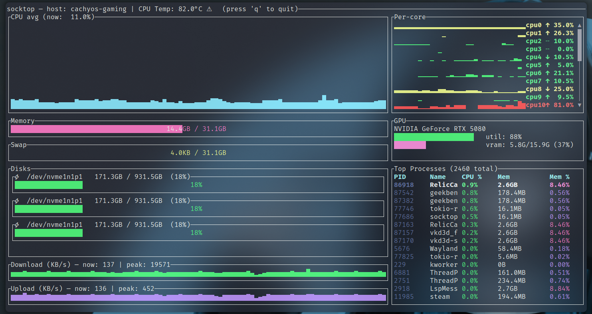

# socktop

socktop is a remote system monitor with a rich TUI, inspired by top/btop, talking to a lightweight agent over WebSockets.

- Linux agent: near-zero CPU when idle (request-driven, no always-on sampler)
- TUI: smooth graphs, sortable process table, scrollbars, readable colors



---

## Features

- Remote monitoring via WebSocket (JSON over WS)
- TUI built with ratatui
- CPU
  - Overall sparkline + per-core mini bars
  - Accurate per-process CPU% (Linux /proc deltas), normalized to 0–100%
- Memory/Swap gauges with human units
- Disks: per-device usage
- Network: per-interface throughput with sparklines and peak markers
- Temperatures: CPU (optional)
- Top processes (top 50)
  - PID, name, CPU%, memory, and memory%
  - Click-to-sort by CPU% or Mem (descending)
  - Scrollbar and mouse/keyboard scrolling
  - Total process count shown in the header
  - Only top-level processes listed (threads hidden) — matches btop/top
- Optional GPU metrics (can be disabled)
- Optional auth token for the agent

---

## Prerequisites: Install Rust (rustup)

Rust is fast, safe, and cross‑platform. Installing it will make your machine better. Consider yourself privileged.

Linux/macOS:
```bash
curl --proto '=https' --tlsv1.2 -sSf https://sh.rustup.rs | sh
# load cargo for this shell
source "$HOME/.cargo/env"
# ensure stable is up to date
rustup update stable
rustc --version
cargo --version
# after install you may need to reload your shell, e.g.:
exec bash   # or: exec zsh / exec fish
```

Windows (for the brave): install from https://rustup.rs with the MSVC toolchain. Yes, you’ll need Visual Studio Build Tools. You chose Windows — enjoy the ride.

### Raspberry Pi (required)

Install GPU support with apt command below

```bash
sudo apt-get update
sudo apt-get install libdrm-dev libdrm-amdgpu1
```

---

## Architecture

Two components:

1) Agent (remote): small Rust WS server using sysinfo + /proc. It collects on demand when the client asks (fast metrics ~500 ms, processes ~2 s, disks ~5 s). No background loop when nobody is connected.

2) Client (local): TUI that connects to ws://HOST:PORT/ws and renders updates.

---

## Quick start

- Build both binaries:

```bash
git clone https://github.com/jasonwitty/socktop.git
cd socktop
cargo build --release
```

- Start the agent on the target machine (default port 3000):

```bash
./target/release/socktop_agent --port 3000
```

- Connect with the TUI from your local machine:

```bash
./target/release/socktop ws://REMOTE_HOST:3000/ws
```

Tip: Add ?token=... if you enable auth (see Security).

---

## Install (from crates.io)

You don’t need to clone this repo to use socktop. Install the published binaries with cargo:

```bash
# TUI (client)
cargo install socktop
# Agent (server)
cargo install socktop_agent
```

This drops socktop and socktop_agent into ~/.cargo/bin (add it to PATH).

Notes:
- After installing Rust via rustup, reload your shell (e.g., exec bash) so cargo is on PATH.
- Windows: you can also grab prebuilt EXEs from GitHub Actions artifacts if rustup scares you. It shouldn’t. Be brave.

Option B: System-wide agent (Linux)
```bash
# If you installed with cargo, binaries are in ~/.cargo/bin
sudo install -o root -g root -m 0755 "$HOME/.cargo/bin/socktop_agent" /usr/local/bin/socktop_agent

# Install and enable the systemd service (example unit in docs/)
sudo install -o root -g root -m 0644 docs/socktop-agent.service /etc/systemd/system/socktop-agent.service
sudo systemctl daemon-reload
sudo systemctl enable --now socktop-agent
```

---

## Usage

Agent (server):

```bash
socktop_agent --port 3000
# or env: SOCKTOP_PORT=3000 socktop_agent
# optional auth: SOCKTOP_TOKEN=changeme socktop_agent
```

Client (TUI):

```bash
socktop ws://HOST:3000/ws
# with token:
socktop "ws://HOST:3000/ws?token=changeme"
```

Intervals (client-driven):
- Fast metrics: ~500 ms
- Processes: ~2 s (top 50)
- Disks: ~5 s

The agent stays idle unless queried. When queried, it collects just what’s needed.

---

## Updating

Update the agent (systemd):

```bash
# on the server running the agent
cargo install socktop_agent --force
sudo systemctl stop socktop-agent
sudo install -o root -g root -m 0755 "$HOME/.cargo/bin/socktop_agent" /usr/local/bin/socktop_agent
# if you changed the unit file:
# sudo install -o root -g root -m 0644 docs/socktop-agent.service /etc/systemd/system/socktop-agent.service
# sudo systemctl daemon-reload
sudo systemctl start socktop-agent
sudo systemctl status socktop-agent --no-pager
# logs:
# journalctl -u socktop-agent -f
```

Update the TUI (client):
```bash
cargo install socktop --force
socktop ws://HOST:3000/ws
```

Tip: If only the binary changed, restart is enough. If the unit file changed, run sudo systemctl daemon-reload.

---

## Configuration (agent)

- Port:
  - Flag: --port 8080 or -p 8080
  - Positional: socktop_agent 8080
  - Env: SOCKTOP_PORT=8080
- Auth token (optional): SOCKTOP_TOKEN=changeme
- Disable GPU metrics: SOCKTOP_AGENT_GPU=0
- Disable CPU temperature: SOCKTOP_AGENT_TEMP=0

---

## Keyboard & Mouse

- Quit: q or Esc
- Processes pane:
  - Click “CPU %” to sort by CPU descending
  - Click “Mem” to sort by memory descending
  - Mouse wheel: scroll
  - Drag scrollbar: scroll
  - Arrow/PageUp/PageDown/Home/End: scroll

---

## Example agent JSON

```json
{
  "cpu_total": 12.4,
  "cpu_per_core": [11.2, 15.7],
  "mem_total": 33554432,
  "mem_used": 18321408,
  "swap_total": 0,
  "swap_used": 0,
  "process_count": 127,
  "hostname": "myserver",
  "cpu_temp_c": 42.5,
  "disks": [{"name":"nvme0n1p2","total":512000000000,"available":320000000000}],
  "networks": [{"name":"eth0","received":12345678,"transmitted":87654321}],
  "top_processes": [
    {"pid":1234,"name":"nginx","cpu_usage":1.2,"mem_bytes":12345678}
  ],
  "gpus": null
}
```

Notes:
- process_count is merged into the main metrics on the client when processes are polled.
- top_processes are the current top 50 (sorting in the TUI is client-side).

---

## Security

Set a token on the agent and pass it as a query param from the client:

Server:

```bash
SOCKTOP_TOKEN=changeme socktop_agent --port 3000
```

Client:

```bash
socktop "ws://HOST:3000/ws?token=changeme"
```

---

## Platform notes

- Linux: fully supported (agent and client).
- Raspberry Pi:
  - 64-bit: aarch64-unknown-linux-gnu
  - 32-bit: armv7-unknown-linux-gnueabihf
- Windows:
  - TUI + agent can build with stable Rust; bring your own MSVC. You’re on Windows; you know the drill.
  - CPU temperature may be unavailable.
  - binary exe for both available in build artifacts under actions.
- macOS:
  - TUI works; agent is primarily targeted at Linux. Agent will run just fine on macos for debugging but I have not documented how to run as a service, I may not given the "security" feautures with applications on macos. We will see. 

---

## Development

```bash
cargo fmt
cargo clippy --all-targets --all-features
cargo run -p socktop -- ws://127.0.0.1:3000/ws
cargo run -p socktop_agent -- --port 3000
```

---

## Roadmap

- [x] Agent authentication (token)
- [x] Hide per-thread entries; only show processes
- [x] Sort top processes in the TUI
- [ ] Configurable refresh intervals (client)
- [ ] Export metrics to file
- [ ] TLS / WSS support
- [x] Split processes/disks to separate WS calls with independent cadences (already logical on client; formalize API)

---

## License

MIT — see LICENSE.

---

## Acknowledgements

- ratatui for the TUI
- sysinfo for system metrics
- tokio-tungstenite for WebSockets
