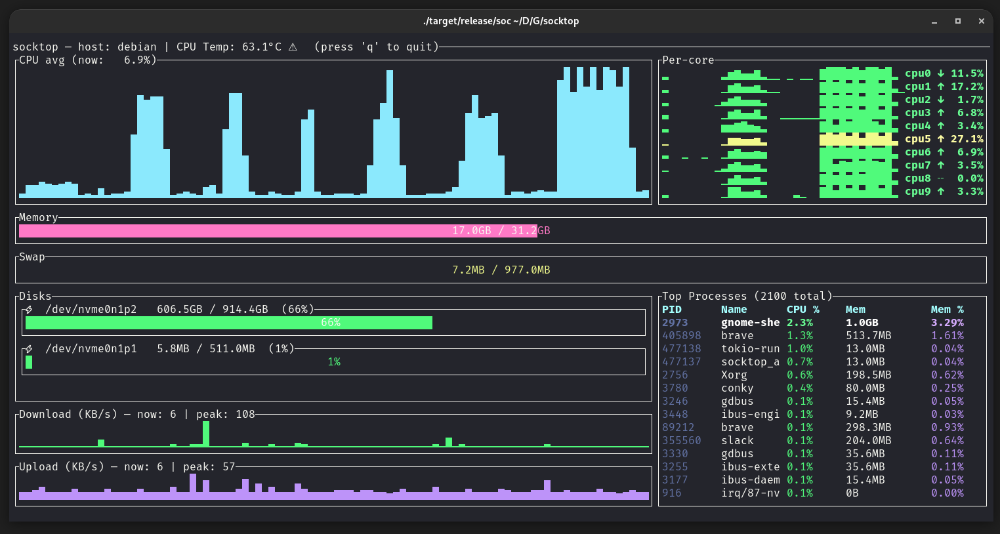

# socktop

**socktop** is a remote system monitor with a rich TUI interface, inspired by `top` and `btop`, that communicates with a lightweight remote agent over WebSockets.

It lets you watch CPU, memory, disks, network, temperatures, and processes on another machine in real-time — from the comfort of your terminal.



---

## Features

- 📡 **Remote monitoring** via WebSocket — lightweight agent sends JSON metrics
- 🖥 **Rich TUI** built with [ratatui](https://github.com/ratatui-org/ratatui)
- 🔍 **Detailed CPU view** — per-core history, current load, and trends
- 📊 **Memory, Swap, Disk usage** — human-readable units, color-coded
- 🌡 **Temperatures** — CPU temperature with visual indicators
- 📈 **Network throughput** — live sparkline graphs with peak tracking
- 🏷 **Top processes table** — PID, name, CPU%, memory, and memory%
- 🎨 Color-coded load, zebra striping for readability
- ⌨ **Keyboard shortcuts**:
  - `q` / `Esc` → Quit

---

## Architecture

`socktop` has **two components**:

1. **Agent** (remote side)  
   A small Rust WebSocket server that runs on the target machine and gathers metrics via [sysinfo](https://crates.io/crates/sysinfo).

2. **Client** (local side)  
   The TUI app (`socktop`) that connects to the agent’s `/ws` endpoint, receives JSON metrics, and renders them.

The two communicate over a persistent WebSocket connection.

---

## Adaptive (idle-aware) sampling

The socktop agent now samples system metrics only when at least one WebSocket client is connected. When idle (no clients), the sampler sleeps and CPU usage drops to ~0%.

How it works
- The WebSocket handler increments/decrements a client counter in `AppState` on connect/disconnect.
- A background sampler wakes when the counter transitions from 0 → >0 and sleeps when it returns to 0.
- The most recent metrics snapshot is cached as JSON for fast responses.

Cold start behavior
- If a client requests metrics while the cache is empty (e.g., just started or after a long idle), the agent performs a one-off synchronous collection to respond immediately.

Tuning
- Sampling interval (active): update `spawn_sampler(state, Duration::from_millis(500))` in `socktop_agent/src/main.rs`.
- Always-on or low-frequency idle sampling: replace the “sleep when idle” logic in `socktop_agent/src/sampler.rs` with a low-frequency interval. Example sketch:

```rust
// In sampler.rs (sketch): sample every 10s when idle, 500ms when active
let idle_period = Duration::from_secs(10);
loop {
    let active = state.client_count.load(Ordering::Relaxed) > 0;
    let period = if active { Duration::from_millis(500) } else { idle_period };
    let mut ticker = tokio::time::interval(period);
    ticker.tick().await;
    if !active {
        // wake early if a client connects
        tokio::select! {
            _ = ticker.tick() => {},
            _ = state.wake_sampler.notified() => continue,
        }
    }
    let m = collect_metrics(&state).await;
    if let Ok(js) = serde_json::to_string(&m) {
        *state.last_json.write().await = js;
    }
}
```

---

## Installation

### Prerequisites
- Rust 1.75+ (recommended latest stable)
- Cargo package manager

### Build from source
```bash
git clone https://github.com/jasonwitty/socktop.git
cd socktop
cargo build --release
```

### Install as a cargo binary
```bash
cargo install --path .
```
This will install the `socktop` binary into `~/.cargo/bin`.

---

## Running

### 1. Start the agent on the remote machine
The agent binary listens on a TCP port and serves `/ws`:

```bash
socktop_agent 0.0.0.0:8080
```

> **Tip:** You can run the agent under `systemd`, inside a Docker container, or just in a tmux/screen session.

### 2. Connect with the client
From your local machine:
```bash
socktop ws://REMOTE_HOST:8080/ws
```

Example:
```bash
socktop ws://192.168.1.50:8080/ws
```

---

## Usage

When connected, `socktop` displays:

**Left column:**
- **CPU avg graph** — sparkline of recent overall CPU usage
- **Memory gauge** — total and used RAM
- **Swap gauge** — total and used swap
- **Disks** — usage per device (only devices with available space > 0)
- **Network Download/Upload** — sparkline in KB/s, with current & peak values

**Right column:**
- **Per-core history & trends** — each core’s recent load, current %, and trend arrow
- **Top processes table** — top 20 processes with PID, name, CPU%, memory usage, and memory%

---

## Configuring the agent port

The agent listens on TCP port 3000 by default. You can override this via a CLI flag, a positional port argument, or an environment variable:

- CLI flag:
  - socktop_agent --port 8080
  - socktop_agent -p 8080
- Positional:
  - socktop_agent 8080
- Environment variable:
  - SOCKTOP_PORT=8080 socktop_agent

Help:
- socktop_agent --help

The TUI should point to ws://HOST:PORT/ws, e.g.:
- cargo run -p socktop -- ws://127.0.0.1:8080/ws

---

## Keyboard Shortcuts

| Key         | Action     |
|-------------|------------|
| `q` or `Esc`| Quit       |

---

## Security (optional token)
By default, the agent exposes metrics over an unauthenticated WebSocket. For untrusted networks, set an auth token and pass it in the client URL:

- Server:
  - SOCKTOP_TOKEN=changeme socktop_agent --port 3000
- Client:
  - socktop ws://HOST:3000/ws?token=changeme

---

## Platform notes
- Linux x86_64/AMD/Intel: fully supported.
- Raspberry Pi:
  - 64-bit: rustup target add aarch64-unknown-linux-gnu; build on-device for simplicity.
  - 32-bit: rustup target add armv7-unknown-linux-gnueabihf.
- Windows:
  - TUI and agent build/run with stable Rust. Use PowerShell:
    - cargo run -p socktop_agent -- --port 3000
    - cargo run -p socktop -- ws://127.0.0.1:3000/ws
  - CPU temperature may be unavailable; display will show N/A.

---

## Using tmux to monitor multiple hosts

You can use tmux to show multiple socktop instances in a single terminal.

Prerequisites:
- Install tmux (Ubuntu/Debian: `sudo apt-get install tmux`)

Key bindings (defaults):
- Split left/right: Ctrl-b %
- Split top/bottom: Ctrl-b "
- Move between panes: Ctrl-b + Arrow keys
- Show pane numbers: Ctrl-b q
- Close a pane: Ctrl-b x
- Detach from session: Ctrl-b d

Two panes (left/right)
- This creates a session named "socktop", splits it horizontally, and starts two socktops.

```bash
tmux new-session -d -s socktop 'socktop ws://HOST1:3000/ws' \; \
  split-window -h 'socktop ws://HOST2:3000/ws' \; \
  select-layout even-horizontal \; \
  attach
```

Four panes (top-left, top-right, bottom-left, bottom-right)
- This creates a 2x2 grid with one socktop per pane.

```bash
tmux new-session -d -s socktop 'socktop ws://HOST1:3000/ws' \; \
  split-window -h 'socktop ws://HOST2:3000/ws' \; \
  select-pane -t 0 \; split-window -v 'socktop ws://HOST3:3000/ws' \; \
  select-pane -t 1 \; split-window -v 'socktop ws://HOST4:3000/ws' \; \
  select-layout tiled \; \
  attach
```

Tips:
- Replace HOST1..HOST4 (and ports) with your targets.
- Reattach later: `tmux attach -t socktop`
- Kill the session: `tmux kill-session -t socktop`

---

## Example agent JSON
`socktop` expects the agent to send metrics in this shape:
```json
{
  "cpu_total": 12.4,
  "cpu_per_core": [11.2, 15.7, ...],
  "mem_total": 33554432,
  "mem_used": 18321408,
  "swap_total": 0,
  "swap_used": 0,
  "process_count": 127,
  "hostname": "myserver",
  "cpu_temp_c": 42.5,
  "disks": [{"name":"nvme0n1p2","total":512000000000,"available":320000000000}],
  "networks": [{"name":"eth0","received":12345678,"transmitted":87654321}],
  "top_processes": [
    {"pid":1234,"name":"nginx","cpu_usage":1.2,"mem_bytes":12345678}
  ]
}
```

---

## Development

### Run in debug mode:
```bash
cargo run -- ws://127.0.0.1:8080/ws
```

### Code formatting & lint:
```bash
cargo fmt
cargo clippy
```

---

## Roadmap
- [ ] Configurable refresh interval
- [ ] Filter/sort top processes in the TUI
- [ ] Export metrics to file
- [ ] TLS / WSS support
- [ ] Agent authentication

---

## License
MIT License — see [LICENSE](LICENSE).

---

## Acknowledgements
- [`ratatui`](https://github.com/ratatui-org/ratatui) for terminal UI rendering
- [`sysinfo`](https://crates.io/crates/sysinfo) for system metrics
- [`tokio-tungstenite`](https://crates.io/crates/tokio-tungstenite) for WebSocket client/server
