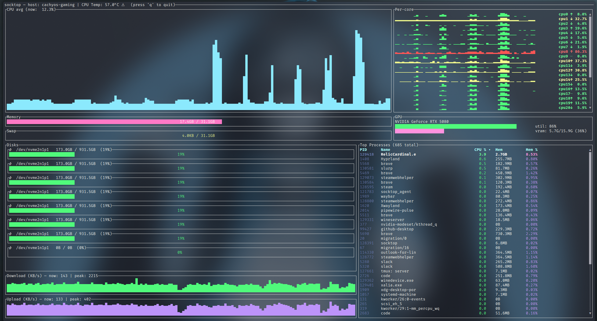

# socktop

socktop is a remote system monitor with a rich TUI, inspired by top/btop, talking to a lightweight agent over WebSockets.

- Linux agent: near-zero CPU when idle (request-driven, no always-on sampler)
- TUI: smooth graphs, sortable process table, scrollbars, readable colors



---

## Features

- Remote monitoring via WebSocket (JSON over WS)
- Optional WSS (TLS): agent auto‑generates a self‑signed cert on first run; client pins the cert via --tls-ca/-t 
- TUI built with ratatui
- CPU
  - Overall sparkline + per-core mini bars
  - Accurate per-process CPU% (Linux /proc deltas), normalized to 0–100%
- Memory/Swap gauges with human units
- Disks: per-device usage
- Network: per-interface throughput with sparklines and peak markers
- Temperatures: CPU (optional)
- Top processes (top 50)
  - PID, name, CPU%, memory, and memory%
  - Click-to-sort by CPU% or Mem (descending)
  - Scrollbar and mouse/keyboard scrolling
  - Total process count shown in the header
  - Only top-level processes listed (threads hidden) — matches btop/top
- Optional GPU metrics (can be disabled)
- Optional auth token for the agent

---

## Prerequisites: Install Rust (rustup)

Rust is fast, safe, and cross‑platform. Installing it will make your machine better. Consider yourself privileged.

Linux/macOS:
```bash
curl --proto '=https' --tlsv1.2 -sSf https://sh.rustup.rs | sh
# load cargo for this shell
source "$HOME/.cargo/env"
# ensure stable is up to date
rustup update stable
rustc --version
cargo --version
# after install you may need to reload your shell, e.g.:
exec bash   # or: exec zsh / exec fish
```

Windows (for the brave): install from https://rustup.rs with the MSVC toolchain. Yes, you’ll need Visual Studio Build Tools. You chose Windows — enjoy the ride.

### Raspberry Pi / Ubuntu / PopOS (required)

Install GPU support with apt command below

```bash
sudo apt-get update
sudo apt-get install libdrm-dev libdrm-amdgpu1
```

---

## Architecture

Two components:

1) Agent (remote): small Rust WS server using sysinfo + /proc. It collects on demand when the client asks (fast metrics ~500 ms, processes ~2 s, disks ~5 s). No background loop when nobody is connected.

2) Client (local): TUI that connects to ws://HOST:PORT/ws (or wss://HOST:PORT/ws when TLS is enabled) and renders updates.

---

## Quick start

- Build both binaries:

```bash
git clone https://github.com/jasonwitty/socktop.git
cd socktop
cargo build --release
```

- Start the agent on the target machine (default port 3000):

```bash
./target/release/socktop_agent --port 3000
```

- Connect with the TUI from your local machine:

```bash
./target/release/socktop ws://REMOTE_HOST:3000/ws
```

### Quick demo (no agent setup)

Spin up a temporary local agent on port 3231 and connect automatically:

```bash
socktop --demo
```

Or just run `socktop` with no arguments and pick the built‑in `demo` entry from the interactive profile list (if you have saved profiles, `demo` is appended). The demo agent:

- Runs locally (`ws://127.0.0.1:3231/ws`)
- Stops automatically (you'll see "Stopped demo agent on port 3231") when you quit the TUI or press Ctrl-C

---

## Install (from crates.io)

You don’t need to clone this repo to use socktop. Install the published binaries with cargo:

```bash
# TUI (client)
cargo install socktop
# Agent (server)
cargo install socktop_agent
```

This drops socktop and socktop_agent into ~/.cargo/bin (add it to PATH).

Notes:
- After installing Rust via rustup, reload your shell (e.g., exec bash) so cargo is on PATH.
- Windows: you can also grab prebuilt EXEs from GitHub Actions artifacts if rustup scares you. It shouldn’t. Be brave.

Option B: System-wide agent (Linux)
```bash
# If you installed with cargo, binaries are in ~/.cargo/bin
sudo install -o root -g root -m 0755 "$HOME/.cargo/bin/socktop_agent" /usr/local/bin/socktop_agent

# Install and enable the systemd service (example unit in docs/)
sudo install -o root -g root -m 0644 docs/socktop-agent.service /etc/systemd/system/socktop-agent.service
sudo systemctl daemon-reload
sudo systemctl enable --now socktop-agent
```

---

## Usage

Agent (server):

```bash
socktop_agent --port 3000
# or env: SOCKTOP_PORT=3000 socktop_agent
# optional auth: SOCKTOP_TOKEN=changeme socktop_agent
# enable TLS (self‑signed cert, default port 8443; you can also use -p):
socktop_agent --enableSSL --port 8443
```

Client (TUI):

```bash
socktop ws://HOST:3000/ws
# with token:
socktop "ws://HOST:3000/ws?token=changeme"
# TLS with pinned server certificate (recommended over the internet):
socktop --tls-ca /path/to/cert.pem wss://HOST:8443/ws
# shorthand:
socktop -t /path/to/cert.pem wss://HOST:8443/ws
# Note: providing --tls-ca/-t automatically upgrades ws:// to wss:// if you forget
```

Intervals (client-driven):
- Fast metrics: ~500 ms
- Processes: ~2 s (top 50)
- Disks: ~5 s

The agent stays idle unless queried. When queried, it collects just what’s needed.

---

## Connection Profiles (Named)

You can save frequently used connection settings (URL + optional TLS CA path) under a short name and reuse them later.

Config file location:

- Linux (XDG): `$XDG_CONFIG_HOME/socktop/profiles.json`
- Fallback (when XDG not set): `~/.config/socktop/profiles.json`

### Creating a profile

First time you specify a new `--profile/-P` name together with a URL (and optional `--tls-ca`), it is saved automatically:

```bash
socktop --profile prod ws://prod-host:3000/ws
# With TLS pinning:
socktop --profile prod-tls --tls-ca /path/to/cert.pem wss://prod-host:8443/ws

You can also set custom intervals (milliseconds):

```bash
socktop --profile prod --metrics-interval-ms 750 --processes-interval-ms 3000 ws://prod-host:3000/ws
```
```

If a profile already exists you will be prompted before overwriting:

```
$ socktop --profile prod ws://new-host:3000/ws
Overwrite existing profile 'prod'? [y/N]: y
```

To overwrite without an interactive prompt pass `--save`:

```bash
socktop --profile prod --save ws://new-host:3000/ws
```

### Using a saved profile

Just pass the profile name (no URL needed):

```bash
socktop --profile prod
socktop -P prod-tls      # short flag
```

The stored URL (and TLS CA path, if any) plus any saved intervals will be used. TLS auto-upgrade still applies if a CA path is stored alongside a ws:// URL.

### Interactive selection (no args)

If you run `socktop` with no arguments and at least one profile exists, you will be shown a numbered list to pick from:

```
$ socktop
Select profile:
  1. prod
  2. prod-tls
Enter number (or blank to abort): 2
```

Choosing a number starts the TUI with that profile. A built‑in `demo` option is always appended; selecting it launches a local agent on port 3231 (no TLS) and connects to `ws://127.0.0.1:3231/ws`. Pressing Enter on blank aborts without connecting.

### JSON format

An example `profiles.json` (pretty‑printed):

```json
{
  "profiles": {
    "prod": { "url": "ws://prod-host:3000/ws" },
    "prod-tls": {
      "url": "wss://prod-host:8443/ws",
      "tls_ca": "/home/user/certs/prod-cert.pem",
      "metrics_interval_ms": 500,
      "processes_interval_ms": 2000
    }
  },
  "version": 0
}
```

Notes:
- The `tls_ca` path is stored as given; if you move or rotate the certificate update the profile by re-running with `--profile NAME --save`.
- Deleting a profile: edit the JSON file and remove the entry (TUI does not yet have an in-app delete command).
- Profiles are client-side convenience only; they do not affect the agent.
- Intervals: `metrics_interval_ms` controls the fast metrics poll (default 500 ms). `processes_interval_ms` controls process list polling (default 2000 ms). Values below 100 ms (metrics) or 200 ms (processes) are clamped.

---

## Updating

Update the agent (systemd):

```bash
# on the server running the agent
cargo install socktop_agent --force
sudo systemctl stop socktop-agent
sudo install -o root -g root -m 0755 "$HOME/.cargo/bin/socktop_agent" /usr/local/bin/socktop_agent
# if you changed the unit file:
# sudo install -o root -g root -m 0644 docs/socktop-agent.service /etc/systemd/system/socktop-agent.service
# sudo systemctl daemon-reload
sudo systemctl start socktop-agent
sudo systemctl status socktop-agent --no-pager
# logs:
# journalctl -u socktop-agent -f
```

Update the TUI (client):
```bash
cargo install socktop --force
socktop ws://HOST:3000/ws
```

Tip: If only the binary changed, restart is enough. If the unit file changed, run sudo systemctl daemon-reload.

---

## Configuration (agent)

- Port:
  - Flag: --port 8080 or -p 8080
  - Positional: socktop_agent 8080
  - Env: SOCKTOP_PORT=8080
- TLS (self‑signed):
  - Enable: --enableSSL
  - Default TLS port: 8443 (override with --port/-p)
  - Certificate/Key location (created on first TLS run):
    - Linux (XDG): $XDG_CONFIG_HOME/socktop_agent/tls/{cert.pem,key.pem} (defaults to ~/.config)
    - The agent prints these paths on creation.
  - You can set XDG_CONFIG_HOME before first run to control where certs are written.
- Auth token (optional): SOCKTOP_TOKEN=changeme
- Disable GPU metrics: SOCKTOP_AGENT_GPU=0
- Disable CPU temperature: SOCKTOP_AGENT_TEMP=0

---

## Keyboard & Mouse

- Quit: q or Esc
- Processes pane:
  - Click “CPU %” to sort by CPU descending
  - Click “Mem” to sort by memory descending
  - Mouse wheel: scroll
  - Drag scrollbar: scroll
  - Arrow/PageUp/PageDown/Home/End: scroll

---

## Example agent JSON

```json
{
  "cpu_total": 12.4,
  "cpu_per_core": [11.2, 15.7],
  "mem_total": 33554432,
  "mem_used": 18321408,
  "swap_total": 0,
  "swap_used": 0,
  "process_count": 127,
  "hostname": "myserver",
  "cpu_temp_c": 42.5,
  "disks": [{"name":"nvme0n1p2","total":512000000000,"available":320000000000}],
  "networks": [{"name":"eth0","received":12345678,"transmitted":87654321}],
  "top_processes": [
    {"pid":1234,"name":"nginx","cpu_usage":1.2,"mem_bytes":12345678}
  ],
  "gpus": null
}
```

Notes:
- process_count is merged into the main metrics on the client when processes are polled.
- top_processes are the current top 50 (sorting in the TUI is client-side).

---

## Security

Set a token on the agent and pass it as a query param from the client:

Server:

```bash
SOCKTOP_TOKEN=changeme socktop_agent --port 3000
```

Client:

```bash
socktop "ws://HOST:3000/ws?token=changeme"
```

### TLS / WSS

For encrypted connections, enable TLS on the agent and pin the server certificate on the client.

Server (generates self‑signed cert and key on first run):

```bash
socktop_agent --enableSSL --port 8443
```

Client (trust/pin the server cert; copy cert.pem from the agent):

```bash
socktop --tls-ca /path/to/agent/cert.pem wss://HOST:8443/ws
```

Notes:
- Do not copy the private key off the server; only the cert.pem is needed by clients.
- When --tls-ca/-t is supplied, the client auto‑upgrades ws:// to wss:// to avoid protocol mismatch.
- You can run multiple clients with different cert paths by passing --tls-ca per invocation.

---

## Using tmux to monitor multiple hosts

You can use tmux to show multiple socktop instances in a single terminal.


monitoring 4 Raspberry Pis using Tmux

Prerequisites:
- Install tmux (Ubuntu/Debian: `sudo apt-get install tmux`)

Key bindings (defaults):
- Split left/right: Ctrl-b %
- Split top/bottom: Ctrl-b "
- Move between panes: Ctrl-b + Arrow keys
- Show pane numbers: Ctrl-b q
- Close a pane: Ctrl-b x
- Detach from session: Ctrl-b d

Two panes (left/right)
- This creates a session named "socktop", splits it horizontally, and starts two socktops.

```bash
tmux new-session -d -s socktop 'socktop ws://HOST1:3000/ws' \; \
  split-window -h 'socktop ws://HOST2:3000/ws' \; \
  select-layout even-horizontal \; \
  attach
```

Four panes (top-left, top-right, bottom-left, bottom-right)
- This creates a 2x2 grid with one socktop per pane.

```bash
tmux new-session -d -s socktop 'socktop ws://HOST1:3000/ws' \; \
  split-window -h 'socktop ws://HOST2:3000/ws' \; \
  select-pane -t 0 \; split-window -v 'socktop ws://HOST3:3000/ws' \; \
  select-pane -t 1 \; split-window -v 'socktop ws://HOST4:3000/ws' \; \
  select-layout tiled \; \
  attach
```

Tips:
- Replace HOST1..HOST4 (and ports) with your targets.
- Reattach later: `tmux attach -t socktop`

---

## Platform notes

- Linux: fully supported (agent and client).
- Raspberry Pi:
  - 64-bit: aarch64-unknown-linux-gnu
  - 32-bit: armv7-unknown-linux-gnueabihf
- Windows:
  - TUI + agent can build with stable Rust; bring your own MSVC. You’re on Windows; you know the drill.
  - CPU temperature may be unavailable.
  - binary exe for both available in build artifacts under actions.
- macOS:
  - TUI works; agent is primarily targeted at Linux. Agent will run just fine on macos for debugging but I have not documented how to run as a service, I may not given the "security" feautures with applications on macos. We will see. 

---

## Development

```bash
cargo fmt
cargo clippy --all-targets --all-features
cargo run -p socktop -- ws://127.0.0.1:3000/ws
# TLS (dev): first run will create certs under ~/.config/socktop_agent/tls/
cargo run -p socktop_agent -- --enableSSL --port 8443
```

---

## Roadmap

- [x] Agent authentication (token)
- [x] Hide per-thread entries; only show processes
- [x] Sort top processes in the TUI
- [ ] Configurable refresh intervals (client)
- [ ] Export metrics to file
- [x] TLS / WSS support (self‑signed server cert + client pinning)
- [x] Split processes/disks to separate WS calls with independent cadences (already logical on client; formalize API)

---

## License

MIT — see LICENSE.

---

## Acknowledgements

- ratatui for the TUI
- sysinfo for system metrics
- tokio-tungstenite for WebSockets
